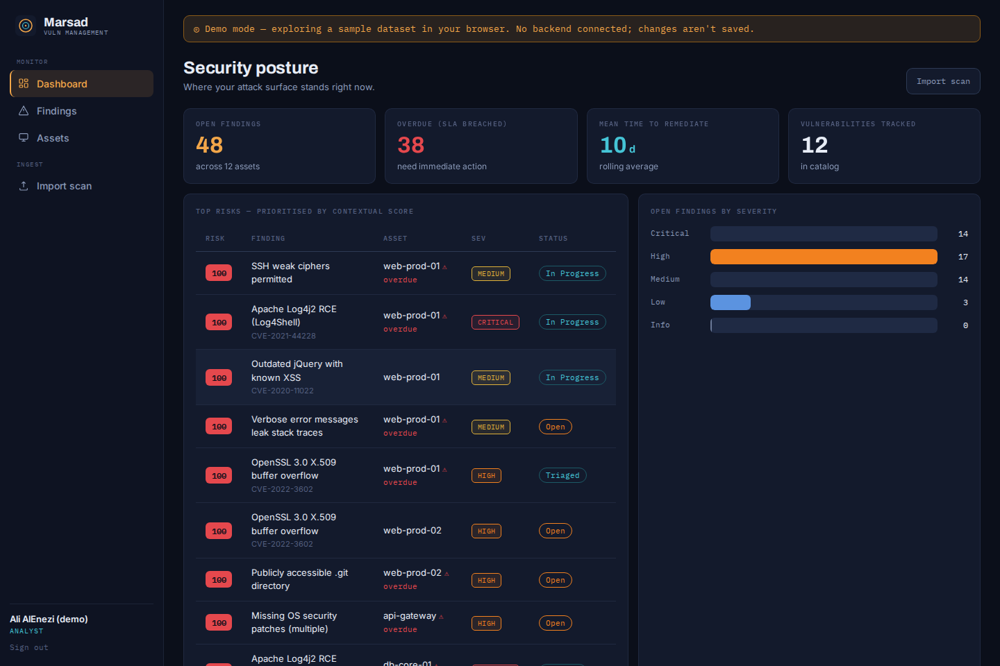
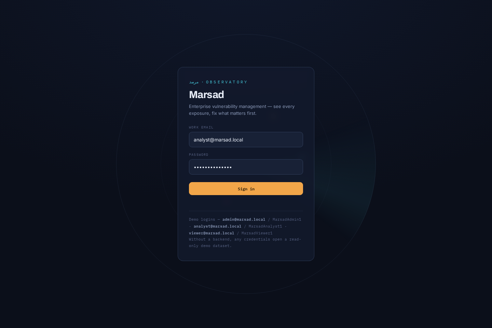
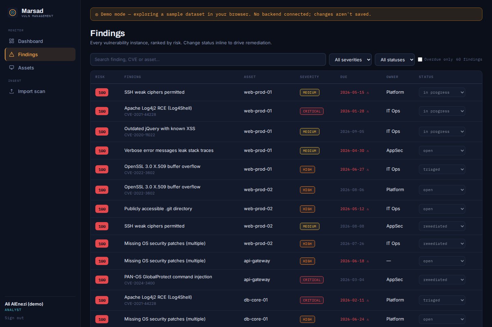
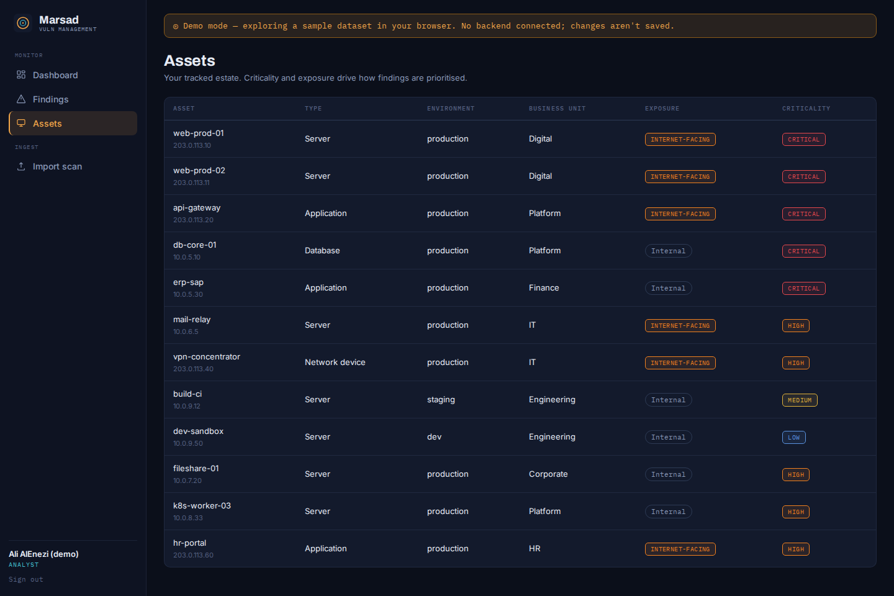
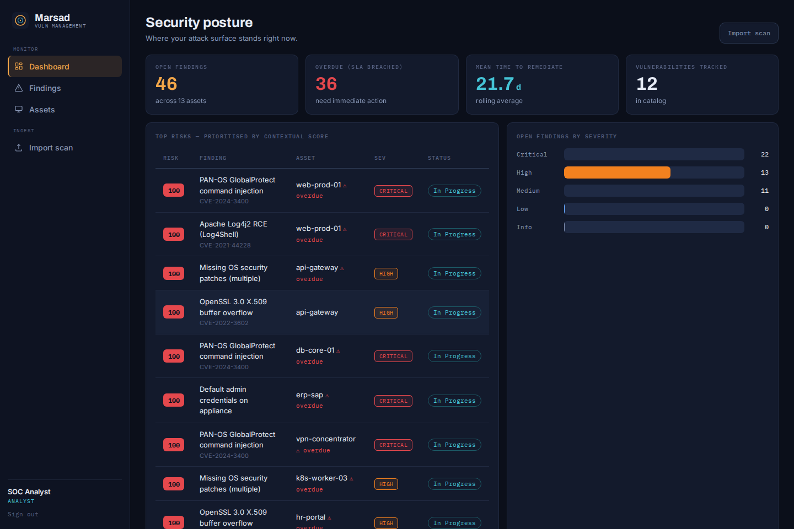

<div align="center">

# Marsad · مرصد

### Enterprise vulnerability management — see every exposure, fix what matters first.

*Marsad* (مرصد) is Arabic for **observatory** — a place built to watch. This one watches your attack surface: it inventories your estate, ingests scanner output, scores every finding by **contextual risk** (not just raw CVSS), enforces remediation **SLAs**, and gives leadership a live dashboard of where the program stands.

A real three-tier platform — **FastAPI · PostgreSQL · role-based multi-user SPA** — not a single-file toy.

[Live demo](https://siteq8.github.io/Marsad/) · [Architecture](docs/ARCHITECTURE.md) · [API reference](docs/API.md)

</div>



## Why Marsad

Most vulnerability programs drown in scanner output. A Nessus export lists 4,000 findings sorted by CVSS, and every one claims to be urgent. What teams actually need is *prioritisation in their own context* and *a workflow to close things* — and the enterprise tools that do this (Qualys VMDR, Tenable, Rapid7) start in the five- and six-figures. Marsad is an open, self-hostable core of that capability:

- **Contextual risk scoring.** A 9.8 CVE on an isolated dev box should not outrank a 7.5 on an internet-facing crown jewel. Marsad multiplies CVSS by asset criticality and exposure into a 0–100 score, so the top of the list is the top of *your* list.
- **A real remediation workflow.** Findings move through open → triaged → in progress → remediated / accepted, with owners, auto-logged status history, and **SLA-driven due dates** (Critical 7d, High 30d, …). Overdue items surface everywhere.
- **Scanner ingestion that de-duplicates.** Import Nessus `.nessus` or CSV. Re-importing next week's scan updates existing findings and reopens anything that came back — it never creates duplicates.
- **Role-based, multi-user.** Admins manage users; analysts triage and remediate; viewers (execs, auditors) get read-only dashboards. Enforced server-side.
- **A real CVSS v3.1 engine.** Spec-faithful, dependency-free, unit-tested against FIRST.org published scores.

## Screenshots

| Sign in | Findings — ranked by contextual risk |
|---|---|
|  |  |

| Asset inventory | Running against the live API |
|---|---|
|  |  |

## Architecture

```
Browser SPA  ──HTTPS──▶  FastAPI (JWT · RBAC · CVSS · importers)  ──SQL──▶  PostgreSQL
 (nginx, /api proxied)      stateless, horizontally scalable              (SQLite for dev)
```

Three tiers, cleanly separated. SQLite for zero-config dev, PostgreSQL for production — swap with one env var. Full detail in [docs/ARCHITECTURE.md](docs/ARCHITECTURE.md).

## Quick start

### Option A — Docker (full stack: Postgres + API + web)
```bash
git clone https://github.com/SiteQ8/Marsad.git && cd Marsad
docker compose up --build
# Web UI:  http://localhost:8080
# API:     http://localhost:8000/docs
```
The API seeds a demo company on first boot. Sign in with `admin@marsad.local` / `MarsadAdmin1`.

### Option B — Backend only (local, SQLite)
```bash
cd backend
pip install -r requirements-dev.txt
python -m app.seed                      # create demo data
uvicorn app.main:app --reload           # http://localhost:8000/docs
pytest -q                               # run the test suite
```
Then open `frontend/index.html?api=http://localhost:8000` in a browser.

### Option C — Just the demo
Open [the live demo](https://siteq8.github.io/Marsad/) — the SPA runs fully in-browser against a bundled dataset, no backend required.

## Default logins (demo seed — change in production)

| Email | Password | Role |
|---|---|---|
| admin@marsad.local | MarsadAdmin1 | admin |
| analyst@marsad.local | MarsadAnalyst1 | analyst |
| viewer@marsad.local | MarsadViewer1 | viewer |

## Testing

```bash
cd backend && pytest -q
```
24 tests cover the CVSS engine (against published vectors), contextual scoring and SLAs, the auth/RBAC flow, the remediation workflow, and scanner-import de-duplication. CI runs them on every push (`.github/workflows/ci.yml`).

## Project status

This is a production-shaped **core platform**, built to be run and extended — the data model, auth, scoring, workflow, importers and dashboards are real and tested. It is a foundation, not a finished commercial product: a full enterprise rollout would add SSO/SAML, scheduled scanner connectors (API pulls from Tenable/Qualys), ticketing integrations (Jira/ServiceNow), historical trend analytics, and per-team scoping. The architecture is deliberately laid out to make those additions incremental. Contributions welcome.

## Security

Passwords are bcrypt-hashed; the API is stateless JWT with server-side RBAC on every mutation. The seeded credentials and default `MARSAD_SECRET_KEY` are for local use only — override them before any real deployment. Please report vulnerabilities via a private issue rather than a public PR.

## Author

**Ali AlEnezi** — [3li.info](https://3li.info) · [@SiteQ8](https://github.com/SiteQ8) · Site@hotmail.com

Sister projects: [Ghirbal](https://siteq8.github.io/Ghirbal/) · [Diwan](https://siteq8.github.io/Diwan/) · [NCA-ECC-Crosswalk](https://siteq8.github.io/NCA-ECC-Crosswalk/)

MIT License — see [LICENSE](LICENSE).
